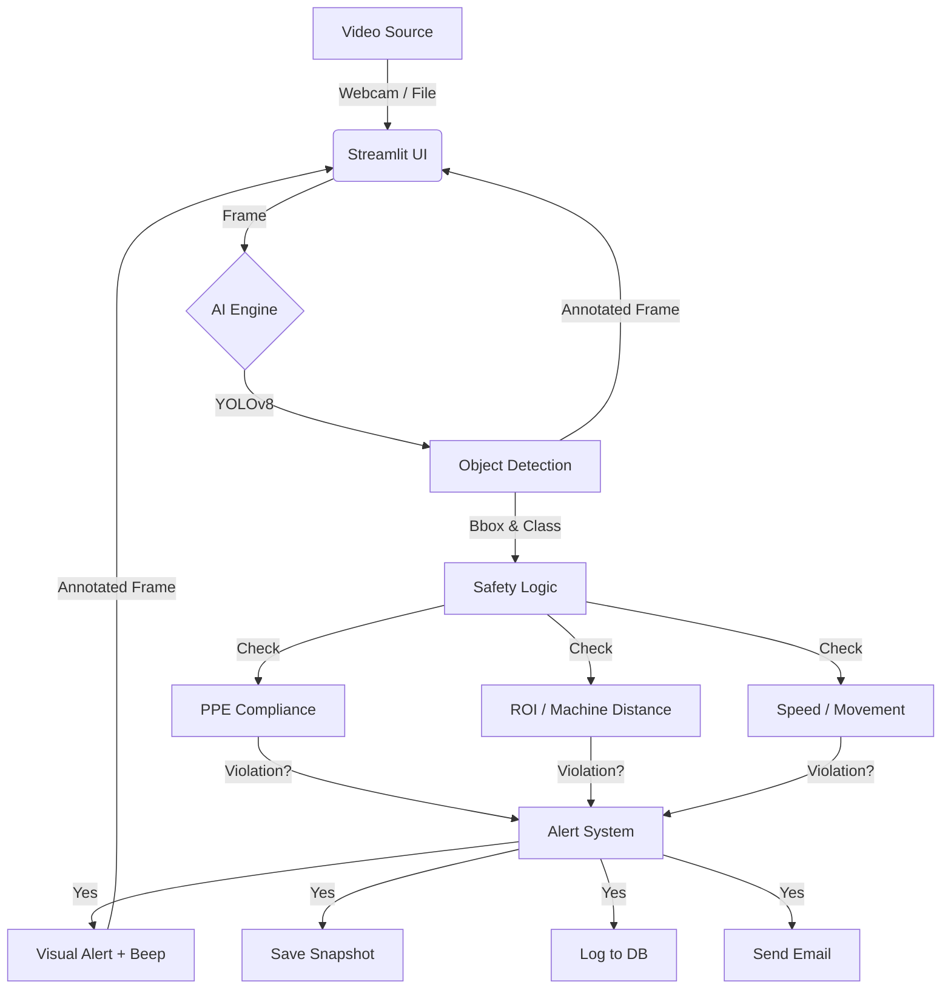

# SafeSight AI - PPE & Safety Monitoring System (MVP)

## 1. Executive Summary
**SafeSight AI** is a computer-vision-based safety monitoring system designed to run on a standard laptop. It uses a custom-trained YOLOv8 model to detect PPE compliance (Hard Hats, Vests) and behavioral safety violations (Running, Entering Dangerous Zones) in real-time.

The system is designed for a **3-day implementation cycle**, prioritizing core functionality, robustness, and a "demo-ready" User Interface.

## 2. System Architecture

### 2.1. High-Level Diagram

### 2.2. Tech Stack
*   **Hardware:** User's Laptop (CPU/GPU).
*   **Training Platform:** Google Colab (Free Tier) + Google Drive.
*   **Core AI:** `ultralytics` (YOLOv8n or YOLOv8s).
*   **Frontend:** `streamlit` (Web Dashboard).
*   **Vision Processing:** `opencv-python`.
*   **Database:** `sqlite3` (Local file: `safesight.db`).
*   **Alerts:** `smtplib` (Email), `pygame`/`playsound` (Audio).

---

## 3. Features & Specifications

### 3.1. Core AI Detection (YOLOv8)
*   **Classes:** `Hardhat`, `Vest`, `Person`, `NO-Hardhat`, `NO-Vest`. (Attempt to include `Boots`/`Goggles` if dataset quality permits).
*   **Model Source:** Custom trained on Roboflow "Construction PPE" dataset via Google Colab.
*   **Performance Target:** 5-15 FPS on Laptop CPU.

### 3.2. Safety Logic Rules
1.  **PPE Violation:**
    *   If `Person` detected WITHOUT `Hardhat` OR `Vest` bounding box intersection -> **Violation**.
    *   *Simplification:* Use model classes `NO-Hardhat` directly if available, otherwise use "Contains" logic.
2.  **Machine Distance (ROI):**
    *   User defines a "Danger Zone" (Polygon) on the UI.
    *   If `Person` centroid is **inside** the Polygon -> **Violation** (Too Close).
3.  **Movement Speed:**
    *   Track `Person` centroid over last 5 frames.
    *   If pixel displacement > `Speed_Threshold` -> **Violation** (Running).

### 3.3. User Interface (Streamlit)
*   **Sidebar:**
    *   Input Source Selector (Webcam / Video File).
    *   Confidence Slider (0.0 - 1.0).
    *   "Define Danger Zone" Toggle.
    *   Email Configuration (Sender/Receiver).
    *   "Work Area Type" Dropdown (Factory, Construction, Office) - *Metadata for logs*.
*   **Main View:**
    *   Live Video Feed with Red/Green bounding boxes.
    *   Real-time "Status" indicators (Safe / Unsafe).
    *   Violation Counter.

### 3.4. Alerting & Logging
*   **Visual:** Red bounding box + "VIOLATION" text overlay.
*   **Audio:** System beep (throttled to once every 3 seconds to avoid noise fatigue).
*   **Snapshot:** Save `.jpg` to `data/violations/YYYY-MM-DD/`.
*   **Email:** Send alert with snapshot (throttled to 1 per minute).
*   **Database:** Insert record: `[Timestamp, ViolationType, WorkArea, ImagePath]`.

---

## 4. Data Strategy (The 3-Day Plan)

### Day 1: Data & Model
1.  **Acquire Data:** Select best "Construction PPE" dataset from Roboflow Universe.
2.  **Train:** Run training notebook on Google Colab (GPU).
    *   Target: 50-100 epochs.
    *   Export: `best.pt` (ONNX or PyTorch format).
3.  **Local Setup:** Install Python dependencies (`ultralytics`, `streamlit`, `opencv`).

### Day 2: Application Core
1.  **Streamlit Skeleton:** Basic UI layout.
2.  **Inference Pipeline:** Load `best.pt` and run on Webcam feed.
3.  **Compliance Logic:** Implement the "PPE Check" and "ROI Polygon" math.

### Day 3: Advanced Features & Polish
1.  **Speed Logic:** Implement simple centroid tracking.
2.  **Alerts:** Connect Email and Audio.
3.  **Integration:** "Work Area" dropdown and SQLite logging.
4.  **Testing:** User validation with sample video.

---

## 5. Alternatives Considered
*   **Full Speed Estimation (km/h):** Rejected. Requires camera calibration and depth estimation. *Decision: Pixel-based heuristic is sufficient for MVP.*
*   **Hardware Sensors (IoT):** Rejected. User only has a laptop. *Decision: Simulation or visual-only detection.*
*   **Cloud Hosting:** Rejected. Latency and cost issues for a 3-day prototype. *Decision: Local execution.*
